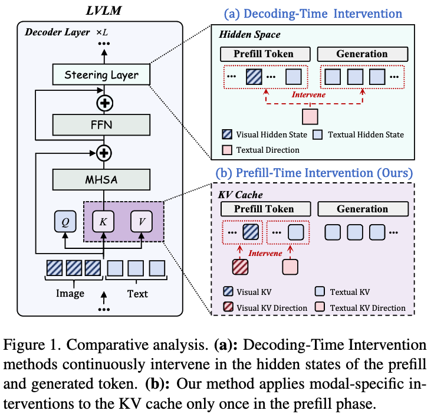
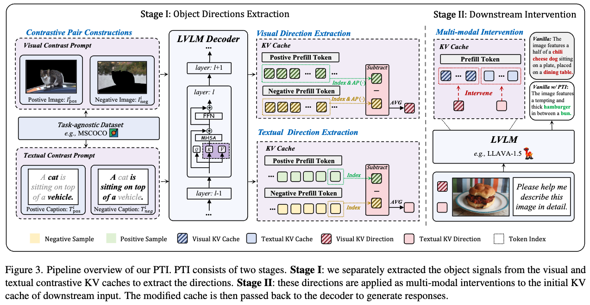

# Prefill-Time Intervention for Mitigating Hallucination in Large Vision-Language Models 

This is the official implementation of the paper "Prefill-Time Intervention for Mitigating Hallucination in Large Vision-Language Models" (CVPR 2026 main).

## Overview

PTI is a training-free, plug-and-play inference-time intervention framework that mitigates hallucinations in Large Vision-Language Models (LVLMs) by operating at the **prefill stage** rather than the decoding stage.


Unlike existing Decoding-Time Intervention (DTI) methods that apply continuous steering during generation and risk snowball hallucinations, PTI intervenes **only once** on the initial KV cache before decoding begins. This proactive approach addresses three core limitations of DTI:

1. **When**: Intervenes during prefill, before errors can accumulate autoregressively
2. **How**: Modality-aware, deriving distinct directions for visual and textual representations
3. **What**: Targets the fine-grained KV cache (keys and values) rather than coarse-grained hidden states



PTI uses object-vs-background contrastive directions to:
- **Steer Keys** → toward visually grounded objects (enhancing object-centric attention)
- **Steer Values** → away from background noise (improving robustness)



## Key Features

- Training-free inference-time intervention
- Intervenes only once at prefill, introducing negligible overhead (<×1.02 latency)
- Modality-aware: separate visual and textual steering directions
- Compatible with diverse decoding strategies (greedy, beam search, nucleus sampling)
- Applicable across multiple LVLM architectures
- Orthogonal to existing decoding-time methods (plug-and-play integration)

## Installation

```bash
# Clone the repository
git clone https://github.com/huaiyi66/PTI
cd PTI

# Install dependencies
conda create -n PTI python=3.11
conda activate PTI
pip install -r requirements.txt
```

## Prepare Data

Download the [MSCOCO 2014](https://cocodataset.org/#home) dataset and extract it to your data directory. The validation set is used for CHAIR evaluation; the training set (100 randomly sampled VQA pairs) is used for direction extraction.

## Usage

### Step 1: Extract Steering Directions (Optional)

Pre-extracted directions for 100 MSCOCO samples are provided as `steering_img_100.pt` (visual) and `steering_txt_100.pt` (textual). To re-extract with custom settings, refer to `anchor.py`.

There are two core functions in `cache_utils/cache_steer.py` for computing PTI directions:

**1. Compute the visual steering directions** (object-vs-background contrast in the KV cache)

```python
# pos_images: object-only images (image ⊙ segmentation mask)
# neg_images: background-only images (image ⊙ (1 - mask))
# Runs two forward passes and averages (pos - neg) across visual token positions
steering_img = extract_steering_kv_img(
    model, tokenizer,
    input_images=input_images,       # original images
    contrast_images=contrast_images, # (neg_image, pos_image) pairs
    input_ids=input_ids,
    contrast_ids=contrast_ids,
    steering_config=steering_config, # aggregation_method='pca'
)
# Returns dict with 'keys' and 'values': {layer_id: tensor[1, n_heads, head_dim]}
```

**2. Compute the textual steering directions** (object-mention-vs-context contrast in the KV cache)

```python
# pos_tokens: input with object anchor words (e.g., "cat", "vehicle")
# neg_tokens: input with anchor words masked (remaining context only)
# Extracts steering vector at the last token position of the sequence
steering_txt = extract_steering_kv_text(
    model, tokenizer,
    input_images=input_images,
    contrast_images=contrast_images,
    input_ids=input_ids,             # (neg_tokens, pos_tokens) pairs
    steering_config=steering_config,
    model_name='llava-1.5',
)
# Returns dict with 'keys' and 'values': {layer_id: tensor[1, n_heads, head_dim]}
```

**3. Save the extracted directions**

```python
torch.save(steering_img, 'steering_img_100.pt')
torch.save(steering_txt, 'steering_txt_100.pt')
```

### Step 2: Run Evaluation

```bash
# CHAIR evaluation with PTI
python chair_eval_cache.py \
    --model "llava-1.5" \
    --data-path '/path/to/coco/val2014' \
    --exp_folder 'chair_pti' \
    --method 'cache' \
    --add_generation_prompt \
    --img_keys 0.1 --img_values 0.6 \
    --txt_keys 0.1 --txt_values 0.6 \
    --n_contrastive_samples 100 \
    --category 'Object' \
    --aggregation_method 'pca'

# Compute CHAIR metrics
python chair_ans.py \
    --cap_file '/path/to/exp_chair/chair_pti/llava-1.5/test.jsonl' \
    --image_id_key image_id \
    --caption_key caption \
    --coco_path /path/to/coco/annotations/ \
    --save_path /path/to/exp_chair/chair_pti/llava-1.5/eval_test.jsonl
```

### Configuration Options

**Model Selection** (`--model`): Supported models are `"llava-1.5"`, `"qwen-vl-chat"`, `"deepseek-vl-chat"`.

**Intervention Strengths**:
- `--img_keys` / `--img_values`: Scalar coefficients λ for visual key/value intervention
- `--txt_keys` / `--txt_values`: Scalar coefficients λ for textual key/value intervention

**Direction Extraction**:
- `--n_contrastive_samples`: Number of MSCOCO samples used to compute steering directions (default: 100)
- `--aggregation_method`: Direction aggregation method, `'pca'` recommended

## Best Practices

-  PTI uses the same λ for visual and textual tokens (`img_keys == txt_keys`, `img_values == txt_values`) to reduce search space.


## Acknowledgement

This project builds upon the following excellent works:
- [VISTA](https://github.com/LzVv123456/VISTA)
- [VTI](https://github.com/opendatalab/VTI)
- [Cache Steering](https://github.com/MaxBelitsky/cache-steering)
- [LLaVA](https://github.com/haotian-liu/LLaVA)

